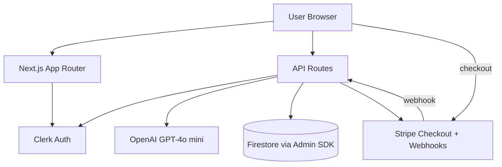

# FlashStudy AI

**Production AI flashcard SaaS** — paste study notes, generate validated decks in seconds, and review with subscription-aware limits, secure cloud storage, and Stripe billing.

[](https://flash-study-ai.vercel.app)
[](https://nextjs.org/)
[](https://www.typescriptlang.org/)
[](.github/workflows/ci.yml)

---

## Impact (Google XYZ)

- **Built and deployed a full-stack AI SaaS** measured by a **live production app** on Vercel with **Clerk auth, Stripe billing, Firestore persistence, and OpenAI generation**, by architecting a **Next.js 14 App Router** backend with **8 server API routes** and zero client-side database access.
- **Enforced monetization and usage limits** measured by **100% server-side gating** on generation (no client bypass), by implementing **Firestore-backed subscription state**, **Stripe webhook sync**, and a **7-day free trial** capped at **2 generations/day**.
- **Improved flashcard learning quality** measured by **complete, accurate answers** (5–30 words) instead of brittle one-word outputs, by redesigning the **OpenAI system prompt** and lowering generation temperature to **0.4**.
- **Raised release confidence** measured by **17 unit tests + 3 Playwright E2E specs** and a **5-step CI pipeline** (lint, typecheck, test, build), by covering subscription logic, validation, Firebase config, and critical user flows.
- **Hardened production operations** measured by a **live `/api/health` endpoint** that verifies **Firestore connectivity** (not just env var presence), by adding async database resolution, project ID validation, and actionable deployment hints.

---

## At a Glance

| Metric | Value |
| --- | --- |
| **Live URL** | [flash-study-ai.vercel.app](https://flash-study-ai.vercel.app) |
| **Stack** | Next.js 14, TypeScript, Clerk, Firebase Admin, OpenAI, Stripe, MUI |
| **Plans** | Free trial + 3 paid tiers (Basic / Standard / Premium) |
| **Trial** | 7 days, 2 AI generations per day |
| **Generation output** | 9 flashcards per request |
| **Automated tests** | 17 unit + 3 E2E |
| **CI checks** | ESLint, TypeScript, Vitest, production build |

---

## Why This Project Matters

FlashStudy AI is not a tutorial clone. It demonstrates how to ship a **real SaaS surface area**:

- Auth-protected routes and APIs
- Paid plans with enforced limits
- Webhook-driven subscription sync
- AI output validation with Zod
- Server-only secrets and Admin SDK database access
- Production diagnostics and error messaging

This is the kind of project you can walk an interviewer through end-to-end: **user sign-up → trial usage → paywall → Stripe checkout → webhook → persisted entitlements → gated AI generation**.

---

## Architecture



### Request flow: generate flashcards

1. User submits study text on `/generate`
2. Clerk middleware + route auth verify identity
3. `/api/generate` checks trial/subscription limits in Firestore
4. OpenAI returns JSON flashcards; Zod validates shape and content
5. Usage counters update in Firestore
6. UI renders flip-card preview; user saves deck to their library

---

## Features

### Product
- AI flashcard generation from pasted study material
- Interactive flip-card review UI with accessible keyboard support
- Saved collections per user
- Usage meter showing trial/subscription status
- Landing page with pricing and Stripe checkout

### Engineering
- TypeScript across app, lib, and API layers
- Zod validation for API input and AI output
- Firebase Admin SDK on server routes only
- Stripe checkout sessions + signed webhooks
- Centralized error handling and Firebase diagnostics
- GitHub Actions CI on every push/PR to `main`

---

## Subscription Model

| Plan | Price | Limit |
| --- | --- | --- |
| **Free Trial** | $0 for 7 days | 2 generations / day |
| **Basic** | $4.99 / month | 100 flashcards / billing period |
| **Standard** | $7.99 / month | Unlimited |
| **Premium** | $9.99 / month | Unlimited |

New users automatically receive the free trial. After it expires, generation requires an active paid subscription.

---

## Tech Stack

| Layer | Choice |
| --- | --- |
| Framework | Next.js 14 (App Router) |
| Language | TypeScript (strict) |
| Auth | Clerk |
| Database | Firebase Firestore (Admin SDK) |
| AI | OpenAI (`gpt-4o-mini`, JSON mode) |
| Payments | Stripe Checkout + Webhooks |
| UI | Material UI + custom design tokens |
| Validation | Zod |
| Unit tests | Vitest |
| E2E tests | Playwright |
| Deployment | Vercel |

---

## Getting Started

### 1. Clone and install

```bash
git clone https://github.com/Arlikhozhaev/FlashStudy-AI.git
cd FlashStudy-AI
npm install --legacy-peer-deps
```

### 2. Environment variables

```bash
cp .env.example .env.local
```

| Variable | Required | Description |
| --- | --- | --- |
| `NEXT_PUBLIC_CLERK_PUBLISHABLE_KEY` | Yes | Clerk publishable key |
| `CLERK_SECRET_KEY` | Yes | Clerk secret key |
| `OPENAI_API_KEY` | Yes | OpenAI API key |
| `NEXT_PUBLIC_STRIPE_PUBLISHABLE_KEY` | Yes | Stripe publishable key |
| `STRIPE_SECRET_KEY` | Yes | Stripe secret key |
| `STRIPE_WEBHOOK_SECRET` | Yes (prod) | Stripe webhook signing secret |
| `FIREBASE_PROJECT_ID` | Yes | Firebase project ID |
| `FIREBASE_CLIENT_EMAIL` | Yes | Service account email |
| `FIREBASE_PRIVATE_KEY` | Yes | Service account private key |
| `NEXT_PUBLIC_STRIPE_*_PRICE_ID` | Optional | Plan-specific Stripe price IDs |
| `FIRESTORE_DATABASE_ID` | Optional | Defaults to `(default)` / `default` |

### 3. Run locally

```bash
npm run dev
```

Open [http://localhost:3000](http://localhost:3000).

---

## Scripts

| Command | Description |
| --- | --- |
| `npm run dev` | Start development server |
| `npm run build` | Production build |
| `npm run start` | Start production server |
| `npm run lint` | ESLint |
| `npm run typecheck` | TypeScript check |
| `npm run test` | Vitest unit tests |
| `npm run test:e2e` | Playwright E2E (auto-starts dev server) |
| `npm run test:e2e:ui` | Playwright interactive UI |

---

## Testing

```bash
npm run lint && npm run typecheck && npm run test && npm run build
```

E2E tests cover landing page content, pricing tiers, and the health endpoint. Unit tests cover subscription enforcement, validation schemas, Firebase key normalization, and AI prompt rules.

---

## Deploy on Vercel

1. Import the GitHub repo into [Vercel](https://vercel.com/new)
2. Set install command: `npm ci --legacy-peer-deps`
3. Add all env vars from `.env.example`
4. Deploy
5. Create Stripe webhook: `https://your-domain.vercel.app/api/webhooks/stripe`
6. Subscribe to: `checkout.session.completed`, `customer.subscription.updated`, `customer.subscription.deleted`
7. Add `STRIPE_WEBHOOK_SECRET` and redeploy
8. Verify: `GET /api/health` → `firestore.connected: true`

Local webhook testing:

```bash
stripe listen --forward-to localhost:3000/api/webhooks/stripe
```

---

## Project Structure

```text
app/
  api/                 Server routes (generate, flashcards, subscription, stripe, health)
  generate/            AI generation workflow
  flashcards/          Saved deck library
  flashcard/           Single-deck review
  sign-in/ sign-up/    Clerk auth pages
components/            Shared UI (Navbar, FlashcardGrid, UsageMeter, AuthShell)
lib/
  plans.ts             Plan definitions + trial rules
  subscription.ts      Entitlements, usage tracking, generation gates
  firebase/            Admin SDK init + diagnostics
  stripe-webhooks.ts   Subscription sync handlers
  openai.ts            Prompt + client
  validation.ts        Zod schemas
e2e/                   Playwright specs
__tests__/             Vitest unit tests
.github/workflows/     CI pipeline
```

---

## Security

- Secrets live in environment variables only — never in source
- Clerk middleware protects routes and APIs
- Firestore client access denied; all reads/writes via Admin SDK on server
- Stripe webhooks verified with signing secret before state updates
- Firebase project ID validated against service account email
- AI responses validated before returning to clients

---

## Interview Talking Points

Use these as 30-second stories:

1. **Auth + authorization:** "I protected both pages and APIs with Clerk middleware, then enforced business rules separately in `/api/generate` so auth alone couldn't bypass billing."
2. **Billing correctness:** "Stripe webhooks are the source of truth — checkout alone doesn't unlock features until the webhook persists subscription state in Firestore."
3. **AI reliability:** "I treat the model as untrusted input: JSON mode + Zod validation + prompt constraints + temperature tuning."
4. **Production debugging:** "I added a health endpoint that actually pings Firestore, which caught a project ID mismatch that env-var checks missed."
5. **UX + accessibility:** "Flashcards use semantic flip states, keyboard flipping, and layout fixes for auth modals and card footers."

---

## Roadmap (Optional Enhancements)

- [ ] Spaced-repetition study mode
- [ ] Deck sharing and export (PDF/Anki)
- [ ] Admin dashboard for usage analytics
- [ ] Rate limiting on `/api/generate`
- [ ] More E2E coverage for auth + checkout flows

---

## Author

**Abdu Alim Arlikhozhaev**

- GitHub: [@Arlikhozhaev](https://github.com/Arlikhozhaev)
- Live demo: [flash-study-ai.vercel.app](https://flash-study-ai.vercel.app)

---

## License

Private project. All rights reserved.
